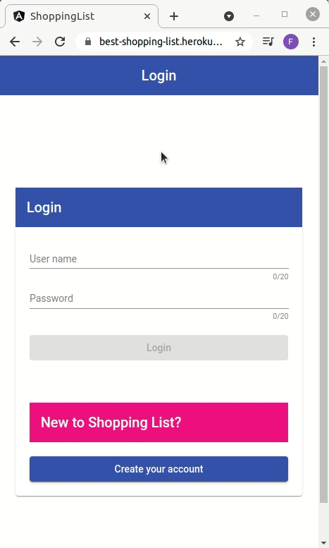
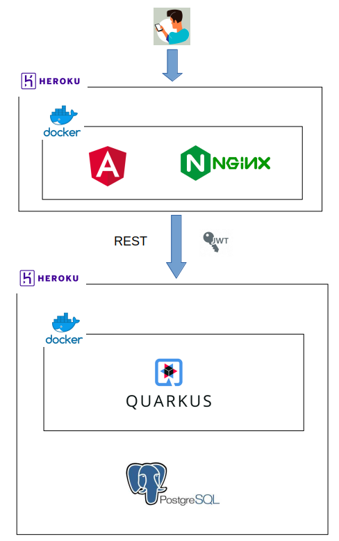

# shopping-list

[Acces this demo version on Heroku and try it right now!](https://best-shopping-list.herokuapp.com/#/)
- The application get dormant after some time without use, so the first access can take some extra time.



Shopping List is a web application that was created especially for mobile devices.

You'll be able to organize the products you want to buy and do your shopping more quickly.

Once you create one account, you can create shopping lists and add products to them.

When you're buying products at the market, you can check the products updating your list and switch from one shopping list to other very easily.

You can, for instance, create one shopping list for fruits, other for cleaning products and another for grocery. So, in the top menu, you will be able to switch between these shoping lists while you're checking the products you already bought.


# Architecture




# Demo version running on Heroku

[Application](https://best-shopping-list.herokuapp.com/#/)

[API swagger](https://shopping-list-back-end.herokuapp.com/q/swagger-ui/)

# Running locally

The test versions have this username and password:
- username `felipe`;
- password `123`;

## From Docker Hub Images

Bring up this [docker-compose](./docker-compose-docker-hub.yml)


## Build Docker images locally and run

Compile Angular and Quarkus project and then bring up this [docker-compose](./docker-compose.yml)

Or just run this script:
```bash
$ ./run-with-local-build.sh
```

## Running in development mode

On development mode, Quarkus will run with H2 database.

### Quarkus

Enter the `quarkus` folder and run:
```bash
$ mvn quarkus:dev
```

[Swagger-ui - development mode](http://localhost:8080/q/swagger-ui/)

### Angular

Enter the `angular` folder and run:
```
$ npm install
$ ng serve
```

[Development mode](http://localhost:4200/#/)


# PostgreSQL

If you want to start locally the PostgreSQL, you can run this Docker image with the tables already created:
```bash
$ docker run -d --name postgres-shop --rm -p 5432:5432 -e POSTGRES_USER=postgres -e POSTGRES_PASSWORD=postgres -e POSTGRES_DB=postgres felipewind/shopping-postgres:13.3
```

 Or enter the postgresql folder and build it with:
 ```bash
 $ docker build -t felipewind/shopping-postgres:13.3 .
 ```

# Authentication on Swagger


To access the protected endpoints, you must:
1. First execute the POST /users/login;
2. Copy the jwt token:
   - 
3. Click on the `Authorize` button on the top right;
4. Paste the jwt token:
   - 

